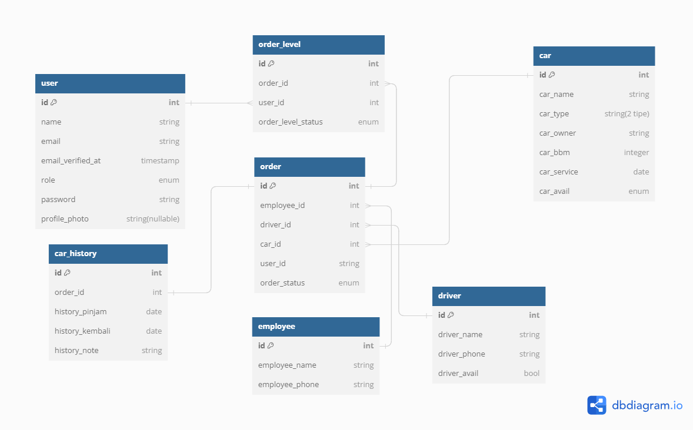
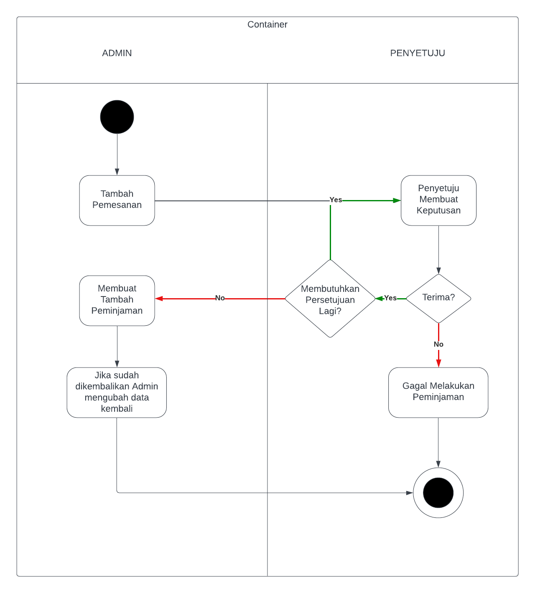

# Technical Test - Backend Developer

## Username Password Role
| Username | Password | Role |
| ----------- | ----------- | ----------- |
| admin@gmail.com | password | Admin |
| acc1@gmail.com | password | Penyetuju |
| acc2@gmail.com | password | Penyetuju |
| acc3@gmail.com | password | Penyetuju |

## Version
| Nama | Versi |
| ----------- | ----------- |
| MariaDB | 10.4.28 |
| PHP | 8.2.4 |
| Composer | 2.5.5 |
| Laravel | 10.14.1 |

## Instalasi
1. Buka Terminal. (ex: git bash, cmd, dll)
2. Clone repository ini menggunakan perintah `git clone https://github.com/ariaschecter/sekawan-media.git`
3. Change direktory menggunakan perintah `cd sekawan-media`
4. Masukkan perintah `composer install` untuk menginstall data vendor
5. Masukkan perintah `cp .env.example .env` untuk menyalin file `.env`
6. Masukkan perintah `php artisan key:generate` untuk mengenerate APP_KEY
7. Masukkan perintah `php artisan migrate` untuk melakukan migrasi database
8. Jika terdapat inputan di terminal tulis `yes` kemudian enter
9. Masukkan perintah `php artisan migrate:fresh --seed` agar DatabaseSeeder dijalankan dan membuat data di database

## Admin Panel (Role: admin)
1. Pastikan terdapat data pada menu sidebar bagian `driver, pegawai, mobil`
2. Pastikan terdapat data dengan role `acc` di menu `user` anda bisa mengganti role dengan menekan tombol `change role`
3. Jika terdapat pegawai yang ingin meminjam mobil maka dapat melakukan `tambah pemesanan` dan mengisi setiap data yang diperlukan, pastikan mengisi data `Pihak Yang Menyetujui` dengan orang yang ingin dimintai persetujuan
4. Menunggu Persetujuan dari `role: penyetuju`

## Persetujuan Panel (Role: penyetuju)
5. Penyetuju dapat `menerima` atau `menolak` setiap pemesanan
6. Jika orang yang menyetujui baru 1 orang, maka `role: penyetuju` wajib menambahkan data `persetujuan lainnya` untuk dimintai persetujuan
7. Jika orang yang menyetujui sudah 2 orang, maka data `persetujuan lainnya` dapat dikosongkan dan proses pemesanan pada admin dapat dilanjutkan
8. Apablia `tidak mendapatkan persetujuan` maka `proses pemesanan gagal, data driver dan mobil kembali seperti semula` (statusnya menjadi ada)

## Admin Panel (Role: admin)
9. Lihat pada menu `Semua Pemesanan` apabila terdapat data dengan `status: terima` maka proses persetujuan dari `role: penyetuju` telah selesai
10. Masuk ke menu `Tambah Peminjaman` dan masukkan data yang sesuai `(order, tanggal pinjam, note)`
11. Jika pegawai telah selesai melakukan peminjaman dapat masuk ke menu `Semua Peminjaman` kemudian edit data dan masukkan `tanggal dikembalikan`
13. Proses Peminjaman telah selesai

## Admin Panel (Role: admin) `Fitur Lain`
1. Admin dapat mengganti tanggal servis berikutnya pada mobil dengan mengganti data yang ada di menu `Semua Mobil`
2. Admin dapat melihat dashboard admin untuk melihat grafik dari peminjaman mobil, `terdapat chart bulan ini dan semua waktu`
3. Admin dapat melakukan `export excel` pada menu `Pemesanan > Export Excel` dan memasukkan tanggal mulai dan tanggal akhir
4. Admin dapat melihat `Log Activity` di menu Log

## Physical Data Model

## Activity Diagram

